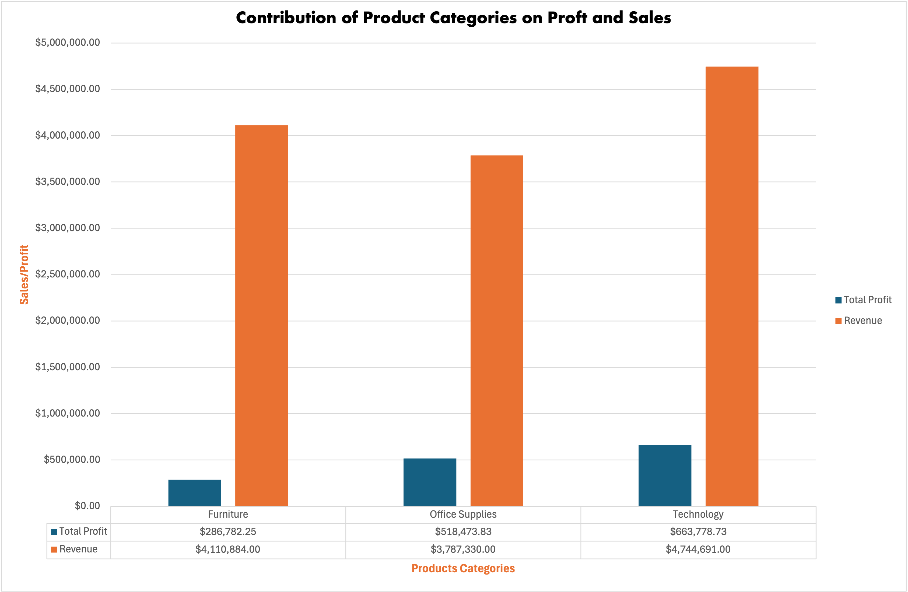
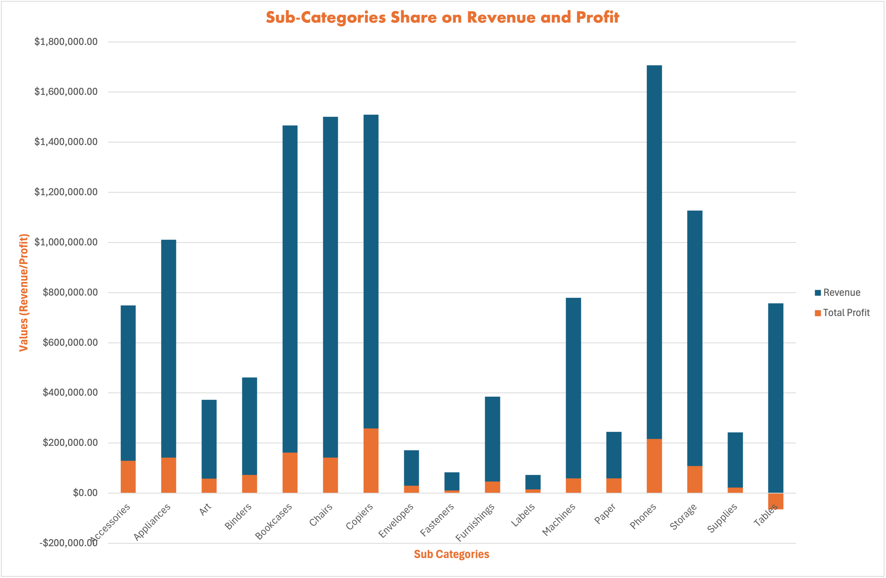
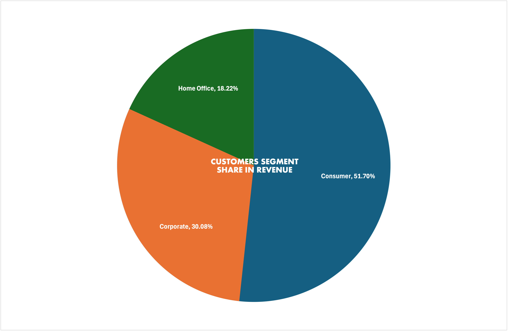
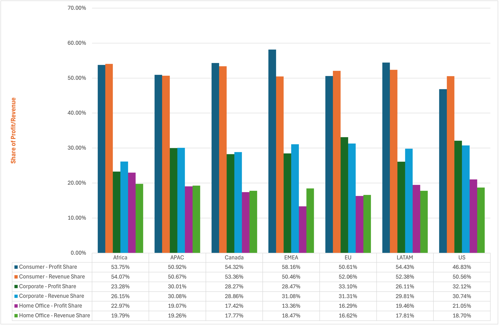
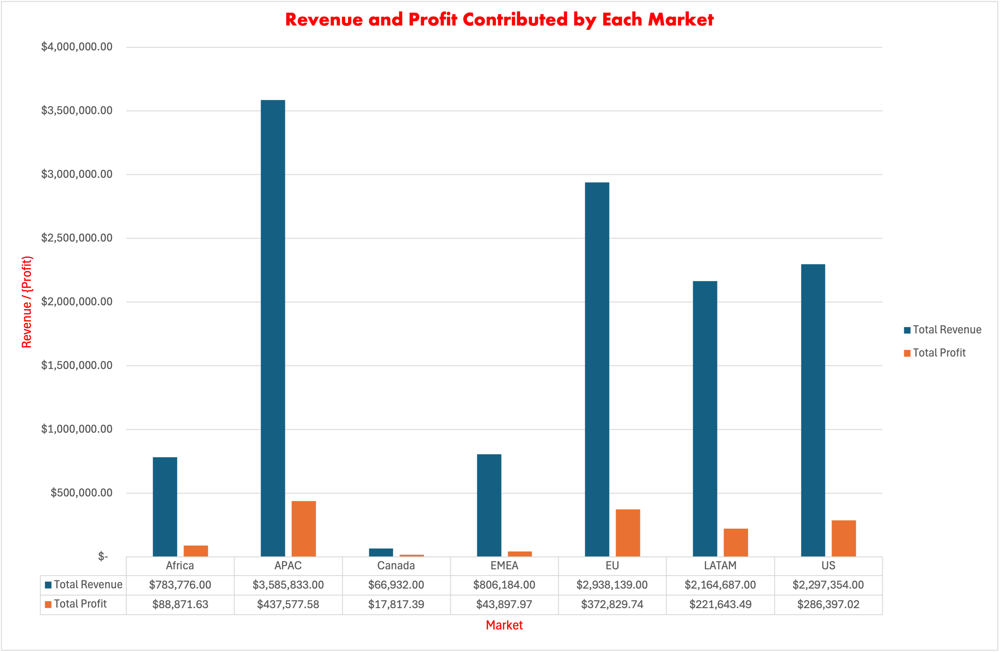
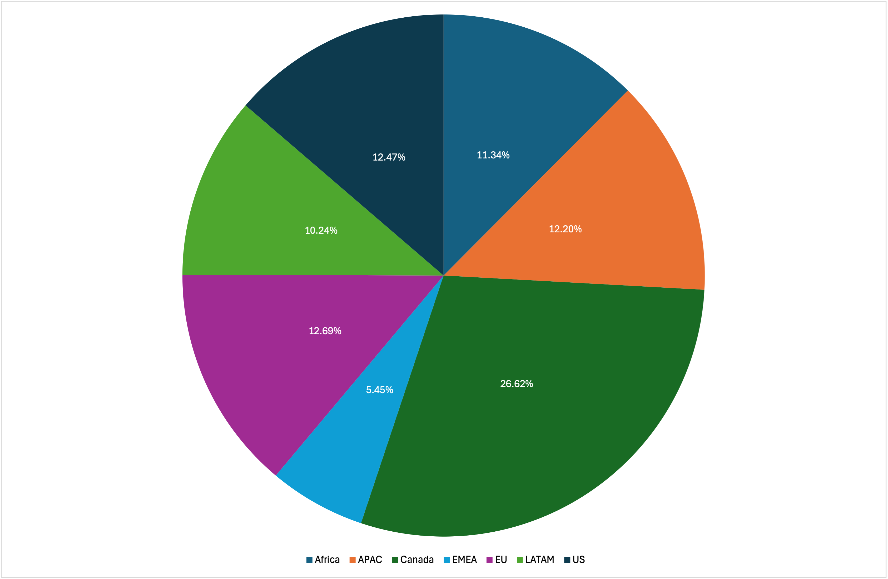

# Superstore Sales Analysis using Microsoft Excel

## Project Overview

This project analyzes over 50,000 retail transactions from a global superstore using Microsoft Excel. The objective is to identify trends in sales, profitability, customer behavior, product performance, and market performance to support data-driven business decisions.

---

## Business Questions

This analysis answers the following questions:

- Which product categories generate the highest revenue and profit?
- Which sub-categories are the most profitable?
- Which customer segments contribute the most revenue?
- How are customers distributed across different markets?
- Which markets are the most profitable?
- Which markets operate most efficiently based on profit margin?

---

## Tools Used

- Microsoft Excel
- Pivot Tables
- Pivot Charts
- Calculated Fields
- Data Cleaning
- KPI Development
- Business Reporting

---

## Key Performance Indicators

- Total Orders
- Total Sales
- Total Profit
- Profit Margin
- Average Order Value
- Quantity Sold

---

## Key Findings

- Technology generated the highest revenue and profit.
- Phones were the highest revenue-generating sub-category.
- Copiers generated the highest total profit.
- Paper recorded the highest profit margin.
- Tables were the only loss-making sub-category.
- Consumer customers generated over half of total revenue.
- Canada achieved the highest profit margin despite being the smallest market.

---

## Repository Structure

```
superstore-sales-analysis-excel/
│
├── data/
├── dashboard/
├── report/
├── images/
└── README.md
```

---

## Future Improvements

This project will be extended using:

- SQL
- Power BI
- R
- Python

to perform deeper analysis and build interactive dashboards.

---
---

# Dashboard & Analysis Preview

## Product Category Analysis



---

## Product Sub-Category Analysis



---

## Customer Segment Analysis



---

## Customer Distribution Across Markets



---

## Market Revenue and Profit



---

## Market Profit Margin



## Author

**Emmanuel Annan**

MSc Political Science (Public Policy Analysis)

Business Data Analytics Portfolio
